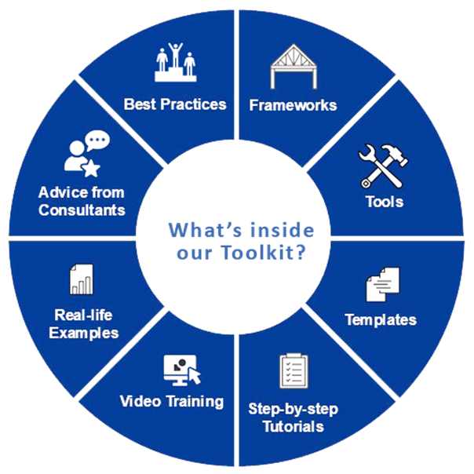
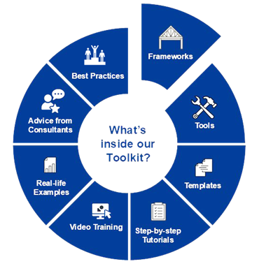
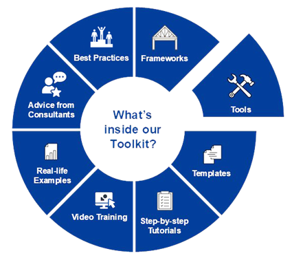
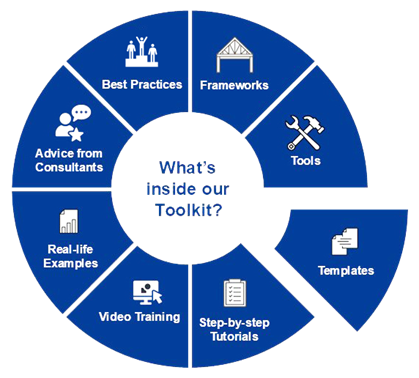
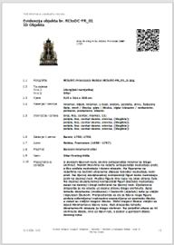
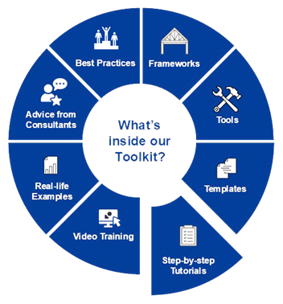
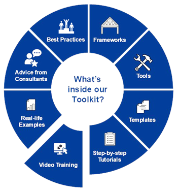
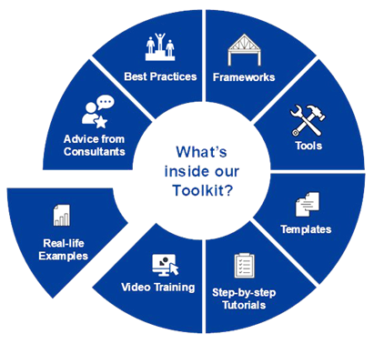
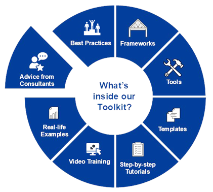
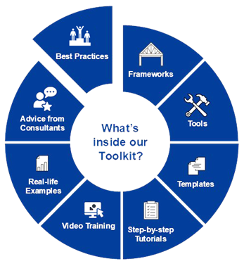

# TOOLKIT FOR 3D AND XR USER-FRIENDLY APP M4

Contents

[**Introduction**](#introduction)

[**Toolkit App Concept**](#toolkit-app-concept)

[**Module 1: FRAMEWORKS**](#module-1-frameworks)

[**Module 2: TOOLS**](#module-2-tools)

[**Module 3: TEMPLATES**](#module-3-templates)

[**Module 4: STEP-BY-STEP TUTORIALS**](#module-4-step-by-step-tutorials)

[**Module 5: VIDEO TRAINING**](#module-5-video-training)

[**Module 6: REAL-LIFE EXAMPLES**](#module-6-real-life-examples)

[**Module 7: ADVICE FROM CONSULTANTS**](#module-7-advice-from-consultants)

[**Module 8: BEST PRACTICES**](#module-8-best-practices)

[**Conclusion**](#conclusion)

## **Introduction**

The 3D and XR Toolkit for Cultural Heritage is a core component of the RCtoDC project, **designed to support cultural heritage institutions (CHIs) in their digitization efforts**. This toolkit will serve as a comprehensive and user-friendly resource, providing step-by-step guidance on digitization workflows, equipment usage, metadata integration, and best practices. The primary goal is to facilitate efficient and high-quality digital preservation, ensuring that CHIs can contribute structured, reusable, and standardized digital assets to the European Data Space for Cultural Heritage.

With the rapid advancement of 3D scanning, photogrammetry, LiDAR, and XR technologies, there is a growing need for accessible and practical tools **that help CHIs navigate the complex technical landscape of digitization**. This toolkit is specifically designed to bridge the gap between technical requirements and practical implementation, offering modular resources that cater to institutions with different levels of expertise and technological capacity.

The initial concept of the toolkit is structured **into multiple key modules**, each addressing a specific aspect of digitization and data integration. These include frameworks for digitization planning, equipment guides, templates for metadata standardization, training materials, and case studies from real-world applications. By leveraging these resources, CHIs will be empowered to execute high-quality 3D and XR digitization projects, ensuring the sustainability and accessibility of their digital collections.

## **Toolkit App Concept**

## **Module 1: FRAMEWORKS**

Project summary

_Grant Preparation (General Information screen) - Provide an overall description of your project (including context and overall objectives, planned activities and main achievements, and expected results and impacts (on target groups, change procedures, capacities, innovation etc)). This summary should give readers a clear idea of what your project is about. Use the project summary from your proposal_

The project will digitize cultural heritage artefacts and make them available to the public through the use of 3D and XR technologies by creating two new collections on Europeana, one of baroque sculptures by Francesco Robba and one of baroque objects from Croatia and Slovenia. Usage of CultArm3D FT10 range Modular 3D Digitization System, will be used to scan the artifacts and ensure highest quality. It will create a user-friendly app -Toolkit for 3D and XR digitization, and offer online and on-site trainings about importance and use of technologies for digitization. The project will also create AR experiences for the public based on the 3D scans.

The project consists of four distinctive WPs executed within 18 months that involve cross-border cooperation of Croatian, Slovenian and Austrian project partners.

General objectives are:

1. Digitize cultural heritage artefacts at risk and make them available to the public through the use of 3D and XR technologies

2. Create a Toolkit for 3D and XR digitization

3. Offer online and on-site trainings for CHIs and other stakeholders

4. Two new collections on Europeana, one of baroque sculptures by Francesco Robba and one of baroque objects from Croatia and Slovenia

5. Equalizing digitization across Europe

Specific objectives are:

1. Digitize 30 objects at risk from southeastern Europe by Francesco Robba and other baroque sculptors

2. Create AR experiences for 30 3D-scanned objects

3. Create training materials and an app for learning about 3D and XR digitization

4. Upload the digitized objects to Europeana and collaborate with other relevant organizations

5. Reduce the physical impact and carbon footprint of cultural heritage preservation

The project contributes to the Digital Europe Program by advancing the digital transformation of cultural heritage institutions and indirectly contributes to the European Green Deal by reducing physical impact and carbon footprint.

[Read More](/Module1)

## **Module 2: TOOLS**

**Purpose:** Provide an overview of equipment/recording tools used for digitization

**Content:**

- **Equipment Overview:**
  - **Artec Leo Scanner:** Detailed specifications, setup instructions.
  - **Artec Space Spider II Scanner:** Detailed specifications, setup instructions.
  - **Canon R5 Mark 2 Camera:** Detailed specifications, setup instructions.
  - **iPhone 15:** Detailed specifications, setup instructions.
- **Software Overview:**
  - Artec Studio 19: Professional software.
  - Agisoft Metashape: Professional software.
  - Axiell Collections: Professional software.
  - Blender: Free and open-source software.
  - Sketchfab: 3D viewer.
  - RCtoDC web platform: For the time being it is intellectual property of RCtoDC.
- **Other accessories necessary for digitization and digitalization**

## **Module 3: TEMPLATES**

**Purpose:** Provide standardized templates for documentation and reporting.

**Content:**

- **Templates:**
  - Object ID template in all languages.
  - …
  - Other types of templates.
    
    

## **Module 4: STEP-BY-STEP TUTORIALS**

**Purpose:** Provide detailed tutorials for digitization and digitalization methods.

**Content:**

- **3D scanners:**
  - Step-by-step guide for setup, scanning, and processing.
- **Photogrammetry with Smartphones:**
  - Step-by-step guide for setup, scanning, and processing.
- **Photography with Cameras:**
  - Step-by-step guide for setup, scanning, and processing.
- **Application of Axiell Collections software for creation and aggregation of cultural heritage institution's databases**:

## **Module 5: VIDEO TRAINING**

**Purpose:** Provide visual education and tutorial for RCtoDC processes.

**Content:**

- **Artec 3D Scanners Demonstration Video:**
  - A complete guide from setup to final scan, highlighting common challenges.
- **Canon Photogrammetry Video:**
  - How to capture a full 3D dataset with a photo camera.
- **iPhone Photogrammetry Video:**
  - Capturing high-quality scans using mobile devices.
- **Blackmagic Pyxis Video Camera Photogrammetry Video:**
  - How to capture a full 3D dataset with a video camera.
- **Axiell Software use of video in application of Object ID standard, Spectrum standard, Europeana Data Model:**

## **Module 6: REAL-LIFE EXAMPLES**

**Purpose:**

**Content:**

- 1. **Excel sheet**

## **Module 7: ADVICE FROM CONSULTANTS**

**Purpose:** Provide access to a network of professionals for consultation and support.

**Content:**

- **Contacts for Expert Advice:**
  - **Media Production 100 GmbH**: Leading partner in RCtoDC project responsible for Toolkit.
  - **Orsula:** Expertise in project management, standards and cultural heritage.
  - **Verus Digital:** Technical experts and producer of equipment.
  - **Artec 3D:** Technical experts and producer of equipment.
  - **Vektra Vision:** Technical experts.
  - **Collections Trust**: Expertise on Spectrum Standard.
  - **J.P.Getty Research Institute and ICOM:** Expertise on Object ID standard.
  - **Europeana**: Expertise on Europeana Data Model (EDM).

Other experts will be added during the further Toolkit development.

- **Guidance on common challenge**s (e.g., data quality, storage, processing).

## **Module 8: BEST PRACTICES**

**Purpose:** As a result of RCtoDC project the best practice is going to be decided on.

## **Conclusion**

The **3D and XR Toolkit for Cultural Heritage** is a crucial step towards democratizing **digitization processes and knowledge-sharing** within the cultural heritage sector. By providing a structured, **step-by-step approach**, the toolkit ensures that institutions of varying capacities can actively participate in the **digital transformation** of cultural heritage.

The integration of **best practices, standardized workflows, and cutting-edge technological guidance** will allow CHIs to improve the **efficiency, accuracy, and interoperability** of their digital collections. Furthermore, by aligning with the **European Data Space for Cultural Heritage**, this initiative enhances **collaborative data-sharing, preservation strategies, and open-access cultural heritage initiatives** at a European level.

Moving forward, the next steps in the **toolkit's development** will focus on **refining its modular structure**, incorporating **feedback from early testing**, and ensuring seamless **integration with existing digitization platforms and repositories**. The long-term vision is to create a **sustainable, adaptable, and evolving resource** that continues to support CHIs beyond the scope of the RCtoDC project, fostering a culture of **digital innovation and preservation excellence**.

